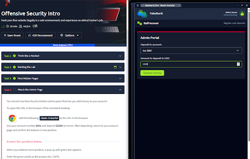

# Project: Web Application Reconnaissance & Broken Access Control

## **Project Description**
In this project, I acted as a security researcher to perform active reconnaissance on a simulated banking application (`fakebank.thm`). My goal was to identify hidden attack surfaces and test for **Broken Access Control** vulnerabilities—specifically, sensitive administrative pages left accessible to the public without authentication.

## **Methodology**
I followed a standard penetration testing workflow:
* **Content Discovery**: Using automated tools to find unlinked directories.
* **Vulnerability Verification**: Manually testing discovered endpoints for access control flaws.
* **Impact Assessment**: Demonstrating the risk by interacting with restricted business logic.

## **Technical Execution**

### **1. Automated Directory Brute-Forcing**
I utilized **Dirb**, a command-line web content scanner, to identify hidden paths by testing a wordlist against the target server.

* **Command**: `dirb http://fakebank.thm`
* **Finding**: The scan successfully identified a hidden directory: `http://fakebank.thm/bank-transfer` with an **HTTP 200 OK** response code.

* **Analysis**: An HTTP 200 code on a "transfer" page suggests the directory is live and potentially accessible without an active session.

### **2. Bypassing Authentication**
I manually navigated to the discovered endpoint in a web browser to check for permission requirements.

* **Action**: Navigated to `http://fakebank.thm/bank-transfer`.
* **Finding**: I gained full, unauthenticated access to a hidden **Admin Portal**. No login prompt or session token was required.

### **3. Exploiting Business Logic**
To demonstrate the severity of this vulnerability, I interacted with the portal’s transfer functionality.

* **Action**: Executed a deposit of **$2,000** into account **8881**.
* **Result**: The transaction was processed successfully without any authorization checks. This confirmed a critical **Broken Access Control** (OWASP A01:2021) vulnerability.

## **Remediation Recommendations**
* **Implement RBAC**: Enforce Role-Based Access Control so that only authenticated administrative users can access the `/bank-transfer` directory.
* **Server-Side Validation**: Ensure all financial transactions are validated on the server side against the user's actual permissions.
* **Disable Directory Indexing**: Configure the web server to return a **403 Forbidden** or **404 Not Found** for unauthorized users attempting to access administrative paths.

## **Summary of Skills Demonstrated**
* **Web Reconnaissance**: Proficiency with `Dirb` and understanding HTTP response codes.
* **Vulnerability Analysis**: Identifying Broken Access Control and "Security through Obscurity" failures.
* **Impact Reporting**: Communicating the real-world financial risk of a technical vulnerability.
